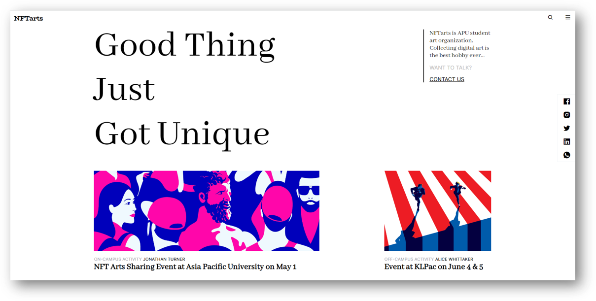
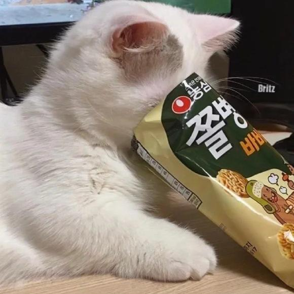

# NFTarts
<!-- Improved compatibility of back to top link: See: https://github.com/othneildrew/Best-README-Template/pull/73 -->
<a name="readme-top"></a>


<!-- PROJECT LOGO -->
<br />
<div align="center">
  <a href="https://github.com/yuenci/NFTarts">
    
  </a>

  <p align="center">
    A great modern website that introduces the art of NFT arts 💎
    <br />
  </p>
</div>

<br />
<br />


<!-- ABOUT THE PROJECT -->
## About The Project



A simple website consists of multiple interlinked web pages with related contents. Design and development are the two stages that each web page goes through. A web page's appearance is defined by web design, while its functionality is defined by web development.

In addition, to maintain consistency, simplicity, feedback, and fault tolerance, a successful website must follow the User Interface Design Principles. (Chappal, 2021) It provides a couple of rules guiding web developers in designing responsive and errorless websites. Likewise, the website's appearance and interaction with users may be improved through five essential multimedia features. Text, images, audio, video, and animation are all included. (Simply Effective Web Design Inc., n.d.)

Furthermore, a completely working website contains various functionalities enabled by the scripting language JavaScript (JS). The combination of Hypertext Markup Language (HTML) + Cascading Style Sheets (CSS) + JS is frequently used for building a website. In short, HTML is used to create a website's structure; CSS is used to design the site's general layout, and JS is used to build the site's functionality.

In this group assignment, our group constructed a student organisation website as the official platform of Asia Pacific University (APU) based on the team model. This website presents the most up-to-date information and activities for members and non-members to guarantee that information can be discovered to the greatest extent possible.


<p align="right">(<a href="#readme-top">back to top</a>)</p>


### Built With

* [idb-keyval](https://github.com/jakearchibald/idb-keyval) - A super-simple-small promise-based keyval store implemented with IndexedDB
* [Anime](https://animejs.com/) - A lightweight JavaScript animation library

<p align="right">(<a href="#readme-top">back to top</a>)</p>


<!-- GETTING STARTED -->
## Getting Started

This project is written in Vanilla js, without any dependency, and can be directly opened locally.

### Installation

1. Clone the repo
   ```sh
   git clone https://github.com/yuenci/NFTarts
   ```
2. Open the index.html locally.
3. Or Open index.html with http server 

<p align="right">(<a href="#readme-top">back to top</a>)</p>


<!-- USAGE EXAMPLES -->
## Usage

Use this space to show useful examples of how a project can be used. Additional screenshots, code examples and demos work well in this space. You may also link to more resources.

_For more examples, please refer to the [Documentation](https://example.com)_

<p align="right">(<a href="#readme-top">back to top</a>)</p>


<!-- CONTRIBUTING -->
## Contributing

If you have a suggestion that would make this better, please fork the repo and create a pull request. You can also simply open an issue with the tag "enhancement".
Don't forget to give the project a star! Thanks again!

1. Fork the Project
2. Create your Feature Branch (`git checkout -b feature/AmazingFeature`)
3. Commit your Changes (`git commit -m 'Add some AmazingFeature'`)
4. Push to the Branch (`git push origin feature/AmazingFeature`)
5. Open a Pull Request

<p align="right">(<a href="#readme-top">back to top</a>)</p>

## Authors
<a href="https://github.com/yuenci" target="_blank" >
  
</a>
<a href="https://github.com/pm00-ops" target="_blank" >
  
</a>
<a href="https://github.com/yannisleng" target="_blank" >
  
</a>

<!-- CONTACT -->
## Contact

Innis - [@InnisYu](https://twitter.com/yuenci3) - yuenci1575270674@gmail.com

Pheymin - [@p_min23](https://www.instagram.com/p_min23/)  

Yannis - [@lengzhiyan1015](https://www.facebook.com/lengzhiyan1015)  


<!-- LICENSE -->
## License

Distributed under the GPL License. See [LICENSE](./LICENSE) for more information.

<p align="right">(<a href="#readme-top">back to top</a>)</p>


<!-- ACKNOWLEDGMENTS -->
## Acknowledgments

* [Ideo](https://ideo.com)
* [Malikafavre](https://www.malikafavre.com)
* [Nftnow](https://nftnow.com)

<p align="right">(<a href="#readme-top">back to top</a>)</p>

